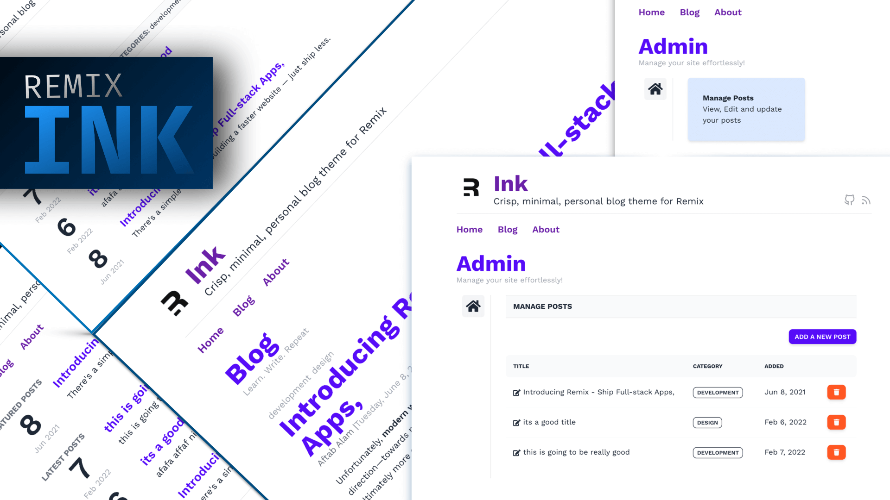

# Remix - Ink
Crisp, minimal, personal blog theme for [Remix](https://remix.run/)

__Remix Ink__ is a minimal blog created to serve minimalistic markdown-based blog needs. It ships with almost all the basic components that you might need while creating light-weight, performant, personal blogs, that rely heavily on server-side techniques to serve blazing-fast experiences, one time, every time.

It's hugely inspired by [Hugo](https://github.com/knadh/hugo-ink)'s Ink theme and strives to remain light, while providing the basis for a beautiful, minimal blog.

## Features
- __Minimal, Crisp, Markdown-Blog Ready__
- __Server Ready__ - There's no explicit client-side interactivity yet. Everything's built using most of the Remix's non-client APIs to run even with JS disabled.
- __Modular__ - The structure is highly modular, with components doing just one job, and one job well.
- __Collection + Dynamic Pages__ - The current implementation supports slug based post details, tag and category based classification
- __Admin Panel/CMS__ - Add/Edit/Update all the posts in the `/blog` directory by visiting `/admin/content` or, alternatively add the markdown posts in the `/content/posts` directory.
- __Auto-generated types and validators__ - The post content you add inside `/src/content/posts` triggers auto-generation of `types` and validation as per the [contentlayer](https://www.contentlayer.dev/docs).config.ts
- __Learn Remix APIs__ You can incrementally learn about the Remix APIs by following the commits [here](https://github.com/one-aalam/remix-ink/commits/main) and I'm working on a series of blog posts that'll teach you about building this app(and learn Remix) ground-up. Follow me [@aftabbuddy](https://twitter.com/aftabbuddy) for updates!
